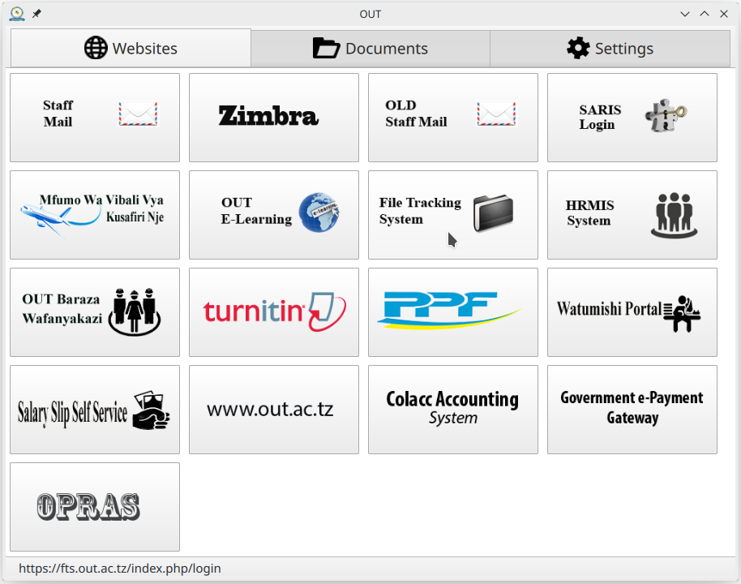
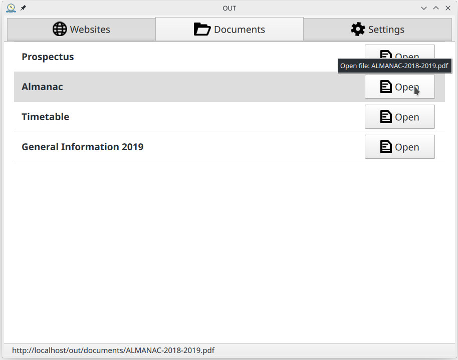
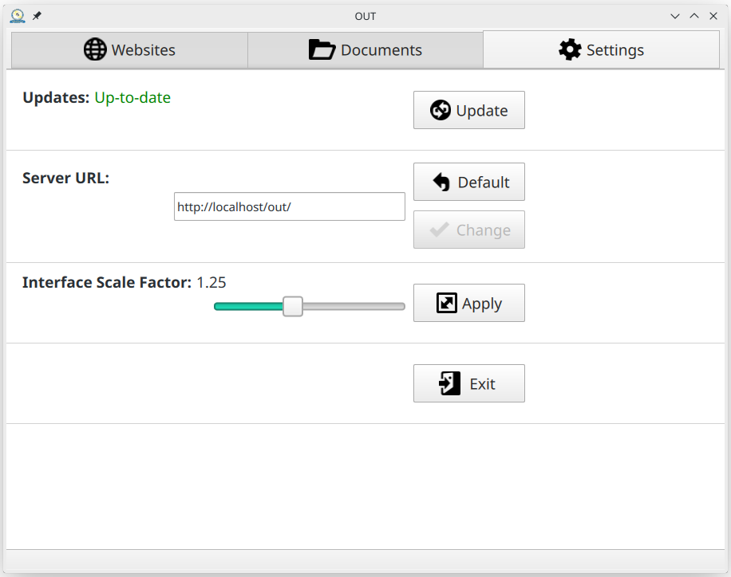

# OUT
The Open University of Tanzania application

@mainpage OUT - The Open University of Tanzania application  
@version 1.0  
@author Jakub Precht  
@date 2019-08-19  
@see https://github.com/precht/out/  

## Introduction

This application was created to help people navigate through different university's online resources and to
provide offline access to important documents.
It is written with the use of Qt framework, mainly in C++ and QML languages.

<b>out-app</b> contains the application project whereas <b>out-installer</b> contains Windows installer project.

## Compilation

Currently the application uses Qt framework version 5.13. Any additional dependencies should be installed automatically 
with the Qt framework. The app is compiled with GCC 9.1.0 under Linux and MinGW 7.3.0 under Windows.

After installing Qt framework open out-app.pro with QtCreator and build the project. To generate documentation from 
source code comments go to <b>docs</b> directory and run '<em>doxygen</em>' from command line (you need to install 
Doxygen and python package called doxyqml; I only did this on Linux, so I don't know if it works on other platforms).

## Updating application content

Application uses very simple update mechanism - there is a HTTP folder on university's server and the application makes
a copy of that folder in local data directory. '<em>websites-list.json</em>' describes what website links should be
visible on the first page and '<em>websites-icons</em>' directory contains icons to be displayed next to these links.
'<em>documents-list.json</em>' describes files to be visible on the second page and '<em>documents</em>' directory is
where local copies of these documents are stored. Thus, it is possible to open these documents without an internet 
connection.

## Windows Installer

In order to make installer you need to copy necessarily files to '<em>out-installer/packages/tz.ac.out/</em>'. First 
you need to copy executable, configurations and resources used by the application. Be sure to copy executable build as 
a release, not the debug! The folder structure should look as follow after copying:  

<pre>
┌── OUT.exe
├── out.ico
├── config.ini
└── resources
    ├── websites-list.json
    ├── documents-list.json
    ├── documents
    │   └── ...
    └── websites-icons
        └── ...
</pre>

Then you need to copy all the dependencies. To do so, run '<em>windeployqt.exe</em>' that can be find in you Qt 
installation directory. (More precisely, if you go to the '<em>bin</em>' directory of a specific version of Qt, you can 
find this executable there). Run it passing as an argument the OUT.exe and it will copy all application's dependencies 
to your current working directory. Unfortunately, it also copies dependencies that aren't required and if we use all of
them then the installer will weight a lot. So, after a few tries, I deduced which files are actually necessarily to run 
OUT application. Copy following files to '<em>out-installer/packages/tz.ac.out/</em>' preserving the folders 
structure:  

<pre>
┌── D3Dcompiler_47.dll
├── libEGL.dll
├── libgcc_s_seh-1.dll
├── libGLESV2.dll
├── libstdc++-6.dll
├── libwinpthread-1.dll
├── libcrypto-1_1-x64.dll
├── libssl-1_1-x64.dll
├── platforms
│   └── qwindows.dll
├── Qt5Core.dll
├── Qt5Gui.dll
├── Qt5Network.dll
├── Qt5Qml.dll
├── Qt5QuickControls2.dll
├── Qt5Quick.dll
├── Qt5QuickTemplates2.dll
├── QtQml
│   └── Models.2
│       ├── modelsplugin.dll
│       ├── plugins.qmltypes
│       └── qmldir
├── QtQuick
│   ├── Controls
│   │   ├── plugins.qmltypes
│   │   ├── qmldir
│   │   └── qtquickcontrolsplugin.dll
│   ├── Controls.2
│   │   ├── Fusion
│   │   │   ├── plugins.qmltypes
│   │   │   ├── qmldir
│   │   │   └── qtquickcontrols2fusionstyleplugin.dll
│   │   ├── qmldir
│   │   └── qtquickcontrols2plugin.dll
│   ├── Layouts
│   │   ├── plugins.qmltypes
│   │   ├── qmldir
│   │   └── qquicklayoutsplugin.dll
│   ├── Templates.2
│   │   ├── plugins.qmltypes
│   │   ├── qmldir
│   │   └── qtquicktemplates2plugin.dll
│   └── Window.2
│       ├── plugins.qmltypes
│       ├── qmldir
│       └── windowplugin.dll
└── QtQuick.2
    ├── plugins.qmltypes
    ├── qmldir
    └── qtquick2plugin.dll
</pre>

Finally, open '<em>out-installer.pro</em>' with Qt Creator and build the project as release. This should create a ready 
installer in the build directory.
